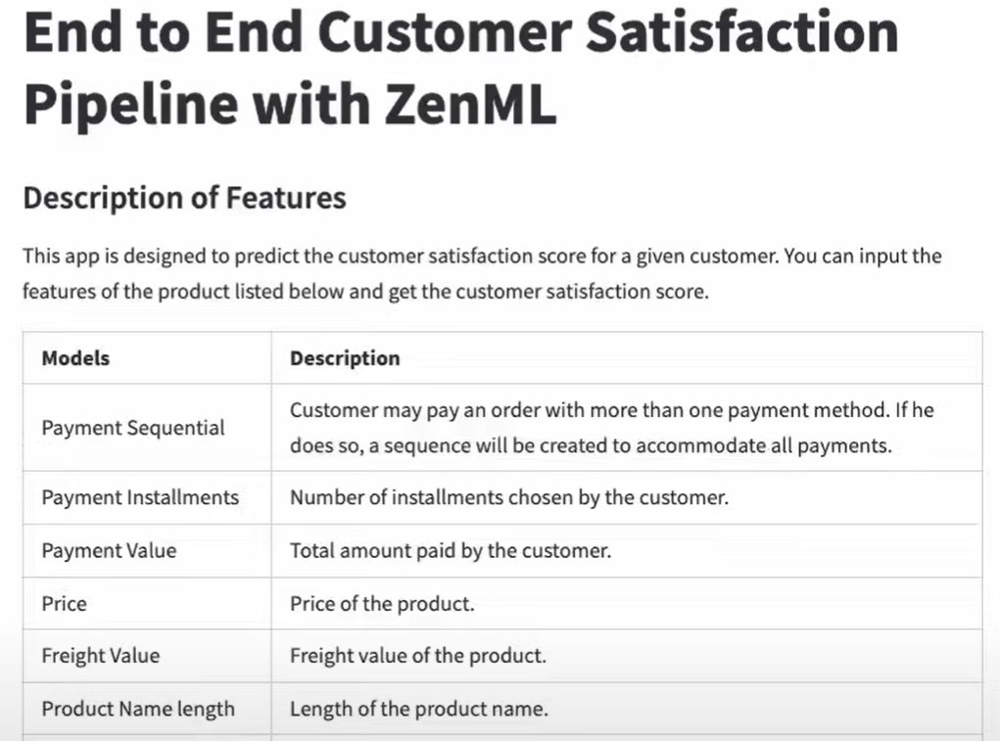
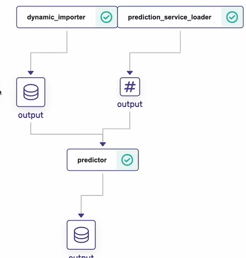

# Predicting how a customer will feel about a product before they even ordered it

### Features

| Feature                      | Description                                                                                      |
| ---------------------------- | ------------------------------------------------------------------------------------------------ |
| Payment Sequential           | Customer may pay an order with more than one payment method. If so, a sequence is created to accommodate all payments. |
| Payment Installments         | Number of installments chosen by the customer.                                                    |
| Payment Value                | Total amount paid by the customer.                                                                |
| Price                        | Price of the product.                                                                            |
| Freight Value                | Freight value of the product.                                                                    |
| Product Name Length          | Length of the product name.                                                                      |
| Product Description Length   | Length of the product description.                                                               |
| Product Photos Quantity      | Number of product published photos.                                                              |
| Product Weight (grams)       | Weight of the product measured in grams.                                                         |
| Product Length (CMs)         | Length of the product measured in centimeters.                                                   |
| Product Height (CMs)         | Height of the product measured in centimeters.                                                   |
| Product Width (CMs)          | Width of the product measured in centimeters.                                                    |
| Target Feature               | Provide the Score accordingly  |


## Results Screen Shot





## How to Use

[](https://pypi.org/project/zenml/)

**Problem statement**: For a given customer's historical data, we are tasked to predict the review score for the next order or purchase. We will be using the [Brazilian E-Commerce Public Dataset by Olist](https://www.kaggle.com/datasets/olistbr/brazilian-ecommerce). This dataset has information on 100,000 orders from 2016 to 2018 made at multiple marketplaces in Brazil. Its features allow viewing charges from various dimensions: from order status, price, payment, freight performance to customer location, product attributes and finally, reviews written by customers. The objective here is to predict the customer satisfaction score for a given order based on features like order status, price, payment, etc. In order to achieve this in a real-world scenario, we will be using [ZenML](https://zenml.io/) to build a production-ready pipeline to predict the customer satisfaction score for the next order or purchase.

The purpose of this repository is to demonstrate how [ZenML](https://github.com/zenml-io/zenml) empowers your business to build and deploy machine learning pipelines in a multitude of ways:

- By offering you a framework and template to base your own work on.
- By integrating with tools like [MLflow](https://mlflow.org/) for deployment, tracking and more
- By allowing you to build and deploy your machine learning pipelines easily

## :snake: Python Requirements

Let's jump into the Python packages you need. Within the Python environment of your choice, run:

```bash
git clone https://github.com/zenml-io/zenml-projects.git
cd zenml-projects/customer-satisfaction
pip install -r requirements.txt
```

Starting with ZenML 0.20.0, ZenML comes bundled with a React-based dashboard. This dashboard allows you
to observe your stacks, stack components and pipeline DAGs in a dashboard interface. To access this, you need to [launch the ZenML Server and Dashboard locally](https://docs.zenml.io/user-guide/starter-guide#explore-the-dashboard), but first you must install the optional dependencies for the ZenML server:

```bash
pip install zenml["server"]
zenml up
```

If you are running the `run_deployment.py` script, you will also need to install some integrations using ZenML:

```bash
zenml integration install mlflow -y
```

The project can only be executed with a ZenML stack that has an MLflow experiment tracker and model deployer as a component. Configuring a new stack with the two components are as follows:

```bash
zenml integration install mlflow -y
zenml experiment-tracker register mlflow_tracker --flavor=mlflow
zenml model-deployer register mlflow --flavor=mlflow
zenml stack register mlflow_stack -a default -o default -d mlflow -e mlflow_tracker --set
```

## 📙 Resources & References

We had written a blog that explains this project in-depth: [Predicting how a customer will feel about a product before they even ordered it](https://blog.zenml.io/customer_satisfaction/).

If you'd like to watch the video that explains the project, you can watch the [video](https://youtu.be/L3_pFTlF9EQ).

## :thumbsup: The Solution

In order to build a real-world workflow for predicting the customer satisfaction score for the next order or purchase (which will help make better decisions), it is not enough to just train the model once.

Instead, we are building an end-to-end pipeline for continuously predicting and deploying the machine learning model, alongside a data application that utilizes the latest deployed model for the business to consume.

This pipeline can be deployed to the cloud, scale up according to our needs, and ensure that we track the parameters and data that flow through every pipeline that runs. It includes raw data input, features, results, the machine learning model and model parameters, and prediction outputs. ZenML helps us to build such a pipeline in a simple, yet powerful, way.

In this Project, we give special consideration to the [MLflow integration](https://github.com/zenml-io/zenml/tree/main/examples) of ZenML. In particular, we utilize MLflow tracking to track our metrics and parameters, and MLflow deployment to deploy our model. We also use [Streamlit](https://streamlit.io/) to showcase how this model will be used in a real-world setting.

### Training Pipeline

Our standard training pipeline consists of several steps:

- `ingest_data`: This step will ingest the data and create a `DataFrame`.
- `clean_data`: This step will clean the data and remove the unwanted columns.
- `train_model`: This step will train the model and save the model using [MLflow autologging](https://www.mlflow.org/docs/latest/tracking.html).
- `evaluation`: This step will evaluate the model and save the metrics -- using MLflow autologging -- into the artifact store.

### Deployment Pipeline

We have another pipeline, the `deployment_pipeline.py`, that extends the training pipeline, and implements a continuous deployment workflow. It ingests and processes input data, trains a model and then (re)deploys the prediction server that serves the model if it meets our evaluation criteria. The criteria that we have chosen is a configurable threshold on the [MSE](https://scikit-learn.org/stable/modules/generated/sklearn.metrics.mean_squared_error.html) of the training. The first four steps of the pipeline are the same as above, but we have added the following additional ones:

- `deployment_trigger`: The step checks whether the newly trained model meets the criteria set for deployment.
- `model_deployer`: This step deploys the model as a service using MLflow (if deployment criteria is met).

In the deployment pipeline, ZenML's MLflow tracking integration is used for logging the hyperparameter values and the trained model itself and the model evaluation metrics -- as MLflow experiment tracking artifacts -- into the local MLflow backend. This pipeline also launches a local MLflow deployment server to serve the latest MLflow model if its accuracy is above a configured threshold.

The MLflow deployment server runs locally as a daemon process that will continue to run in the background after the example execution is complete. When a new pipeline is run which produces a model that passes the accuracy threshold validation, the pipeline automatically updates the currently running MLflow deployment server to serve the new model instead of the old one.

To round it off, we deploy a Streamlit application that consumes the latest model service asynchronously from the pipeline logic. This can be done easily with ZenML within the Streamlit code:

```python
service = prediction_service_loader(
   pipeline_name="continuous_deployment_pipeline",
   pipeline_step_name="mlflow_model_deployer_step",
   running=False,
)
...
service.predict(...)  # Predict on incoming data from the application
```

While this ZenML Project trains and deploys a model locally, other ZenML integrations such as the [Seldon](https://github.com/zenml-io/zenml/tree/main/examples/seldon_deployment) deployer can also be used in a similar manner to deploy the model in a more production setting (such as on a Kubernetes cluster). We use MLflow here for the convenience of its local deployment.


## :notebook: Diving into the code

You can run two pipelines as follows:

- Training pipeline:

```bash
python run_pipeline.py
```

- The continuous deployment pipeline:

```bash
python run_deployment.py
```

## 🕹 Demo Streamlit App

There is a live demo of this project using [Streamlit](https://streamlit.io/) which you can find [here](https://share.streamlit.io/ayush714/customer-satisfaction/main). It takes some input features for the product and predicts the customer satisfaction rate using the latest trained models. If you want to run this Streamlit app in your local system, you can run the following command:-

```bash
streamlit run streamlit_app.py
```

## :question: FAQ

1. When running the continuous deployment pipeline, I get an error stating: `No Step found for the name mlflow_deployer`.

   Solution: It happens because your artifact store is overridden after running the continuous deployment pipeline. So, you need to delete the artifact store and rerun the pipeline. You can get the location of the artifact store by running the following command:

   ```bash
   zenml artifact-store describe
   ```

   and then you can delete the artifact store with the following command:

   **Note**: This is a dangerous / destructive command! Please enter your path carefully, otherwise it may delete other folders from your computer.

   ```bash
   rm -rf PATH
   ```

2. When running the continuous deployment pipeline, I get the following error: `No Environment component with name mlflow is currently registered.`

   Solution: You forgot to install the MLflow integration in your ZenML environment. So, you need to install the MLflow integration by running the following command:

   ```bash
   zenml integration install mlflow -y
   ```
